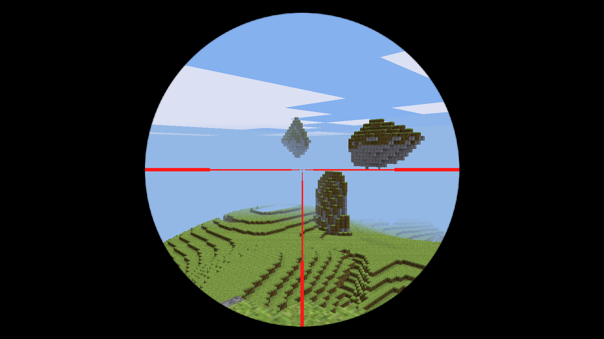

# Sniper 

Sniper is a Minetest mod which adds advanced sniper rifles to the game. Sniper comes with a default rifle, and it also provides a nice API to register custom rifles. It differs from other gun mods in that it's very realistic - this mod supports functional-scopes with zoom, realistic recoil, accurate shoot and reload sounds, and more on a per-rifle basis - check out the registration section for more details.

**Current version:** v0.3



## Registering custom rifles

New sniper rifles can be registered using the `sniper.register_rifle(name, def)` function, where `name` is a string used to address the rifle internally, and `def` is a table containing the rifle's definition. Here's an example def table that provides the available fields with their default values:

```lua
{
    -- The name displayed in the inventory and other places visible to the player.
    display_name = "Sniper Rifle",

    -- Inventory and wield images
    inventory_image = "",
    wield_image = "",

    -- Scope FOV (in degrees) is used to specify the amount of zoom provided by the rifle's scope.
    -- Valid range of values: 1 to 160
    scope_fov = 60,

    -- Scope style accepts values from 1 to 4. Style 1 is the simplest, style 4 is the most sophisticated.
    scope_style = 1,

    -- Damage dealt (in HP) will be calculated using the following formula: "sniper.base_dmg * damage_mult".
    -- Valid range of values: 0.1 to 5
    damage_mult = 1.0,

    -- Stability multiplier affects the amount of recoil after every shot.
    -- The more stable a rifle is, the slower a player would move while using it.
    -- Valid range of values: 0.1 to 5
    stab_mult = 1.0,

    -- Fire rate multiplier is used to calculate the reload time between each shot.
    -- Valid range of values: 0.1 to 5
    fire_rate = 1.0
}
```

## Making use of the bleeding-edge features

This mod makes use of features that haven't been merged into the engine just yet. To make use of them, follow the given instructions below:

- [Player FOV overriding](https://github.com/minetest/minetest/pull/7557)
  - Apply the above PR, and switch to [`feature/fov`](https://github.com/ClobberXD/sniper/tree/feature/fov) branch
- [`register_on_wielditem_change` callback](https://github.com/minetest/minetest/pull/7587)
  - Apply the above PR, and switch to [`feature/wielditem_change`](https://github.com/ClobberXD/sniper/tree/feature/wielditem_change) branch

## TODO

- Provide more rifles with the mod itself.
- Ability to upgrade. e.g. better scope, improved stability, etc.
  - Maybe pass another table to `sniper.register_rifle` defining all possible upgrade paths?
- Support for custom shoot/reload sounds; default to provided sounds.
- Support for per-rifle "perks".

### License: MIT

### Attributions

- [sniper_shoot.ogg](https://freesound.org/people/EMSIarma/sounds/108852/) (CC-BY-SA 3.0)
- [sniper_scope_toggle.ogg](https://freesound.org/people/TicTacShutUp/sounds/406/) (CC-BY-SA 3.0)
- [sniper_reload.ogg](https://freesound.org/people/SpliceSound/sounds/153560/) (CC0 / Public domain)
